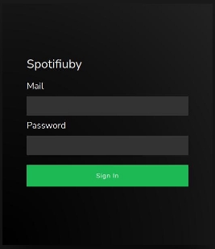
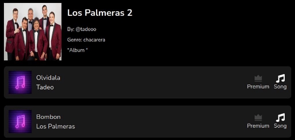

# GUIA DE USUARIO: Backoffice Web

Esta web podrá ser utilizada por los administradores para acceder a información sobre usuarios, contenidos y transacciones.

## Indice
1. [Iniciar sesión](#iniciarsesion)
2. [Usuarios](#usuarios)
4. [Contenidos](#contenidos)
3. [Transacciones](#transacciones)

## Iniciar sesión 

Para ingresar sesión se deberá utilizar el mail y clave provisto por un administrador

## Usuarios 

Al ingresar a la sección de usuarios, se podrá observar un listado de todos los usuarios del sistema.

Para cada usuario se puede observar a simple vista su:

- Nombre de usuario
- Mail
- Foto de perfil
- Tipo suscripción:  si no está suscrito, o  si es premium
- Artista:  si no es artista, o si es artista

Al seleccionar un usuario se puede observar más información acerca del mismo como:

- Teléfono
- Ubicación
- Descripción
- Albums asociados en caso de ser artista

## Contenidos 

Al ingresar a la sección de contenidos, se podrá observar un listado de todos los contenidos del sistema.

Se puede filtrar el contenido por álbumes, canciones, o ambos.

Para cada contenido se puede observar a simple vista:

- Imagen asociada
- Título
- Suscripción necesaria:  si no se requiere, o  si es premium
- Tipo de contenido: Canción  o Álbum 

### Canción:

Al seleccionar una canción se podrá observar más información sobre la misma

### Álbum:
Al seleccionar un álbum se podrá observar más información sobre el mismo, así como también las canciones que lo componen.

## Transacciones 

Al ingresar a la sección de transacciones, se podrá observar un listado de todas las transacciones.

Para cada transacción se muestra:

- Usuario de la transacción
- Hash de transacción

Se puede además filtrar por usuarios mediante la barra de busquedas.

