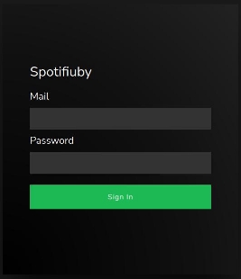
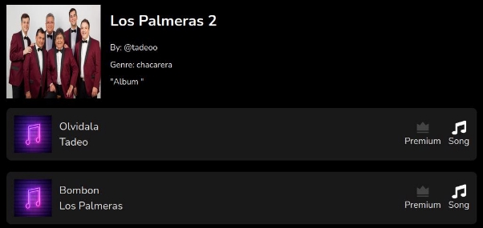

**GUIA DE USUARIO: Backoffice Web**

Esta web podrá ser utilizada por los administradores para acceder a información sobre usuarios, contenidos y transacciones.

**Iniciar sesión**

Se podrá ingresar sesión utilizando el mail y clave provisto por un administrador

**Usuarios**

Al ingresar a la sección de usuarios, se podrá observar un listado de todos los usuarios del sistema.

Para cada usuario se puede observar a simple vista su:

- Nombre de usuario
- Mail
- Foto de perfil
- Tipo suscripción:  si no está suscrito, o  si es premium
- Artista:  si no es artista, o si es artista

Al seleccionar un usuario se puede observar más información acerca del mismo como:

- Teléfono
- Ubicación
- Descripción
- Albums asociados en caso de ser artista

**Contenidos**

Al ingresar a la sección de contenidos, se podrá observar un listado de todos los contenidos del sistema.

Se puede filtrar el contenido por álbumes, canciones, o ambos.

Para cada contenido se puede observar a simple vista:

- Imagen asociada
- Título
- Suscripción necesaria:  si no se requiere, o  si es premium
- Tipo de contenido: Canción  o Álbum 

**Canción:**

Al seleccionar una canción se podrá observar más información sobre la misma

**Álbum:**

Al seleccionar un álbum se podrá observar más información sobre el mismo, así como también las canciones que lo componen.

**Transacciones**

Al ingresar a la sección de transacciones, se podrá observar un listado de todas las transacciones.

Para cada transacción se muestra:

- Usuario de la transacción
- Hash de transacción

Se puede además filtrar por usuarios mediante la barra de busquedas.
